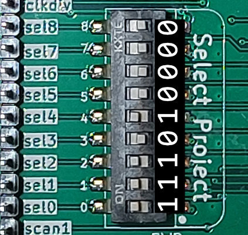
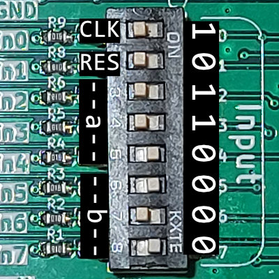

# Bringup of Tiny Tapeout Project 023: 4-bit Multiplier

This project multiplies two 3-bit numbers (with a 4th bit being added as a leading zero) to an 8-bit output value. This then gets shown by the integrated 7-segment display in hex. It switches between the most and least significant nibble (4 bits). If it shows the least significant one, the dot is activated as well.

## Links

[TT02 overview page](https://tinytapeout.com/runs/tt02/)

[Project 23 on TT02: 4-bit Multiplier](https://tinytapeout.com/runs/tt02/023/)

[GitHub repo containing the GDS of the 4-bit Multiplier](https://github.com/kuriousd/tt02-4bit-multiplier)

## Hardware needed

- Tiny Tapeout 2 Demo Board

no additional hardware needed!

## Setup

Select the project by setting the DIP switches to ``000 010 111``.

The project specifies a 2.5kHz clock, however others have shown to work as well. This clock is expected on pin ``in0``, and could be suppplied externally. The board also features a built in oscillator with a clock divider. The divisor is chosen by the input byte and locked in by plugging in the provided bridge into the ``SLOWCLK`` pins at the top left of the board. After that, the inputs can be used in a regular fashion.

I have tested the project running with the clock divisor initated at ``0000 0000`` for 2kHz and ``0000 0001`` (``in0`` high) for 1.2kHz and both worked perfectly fine.

It is advised to reset any device before using it. To do this, switch ``in1`` to high and back to low (the reset is active high).

## Play!

Now the inputs ``in2`` to ``in4`` can be used to put in the first number, and the inputs ``in5`` to ``in7`` the second number. For an example, let's multiply the numbers ``0100`` and ``0101`` which should yield 20.

The output can be read as described in the introduction: ``1`` and ``4.`` are in hex. First convert them to binary and join, so ``0001 0100``, which is 20 in decimal. It works!